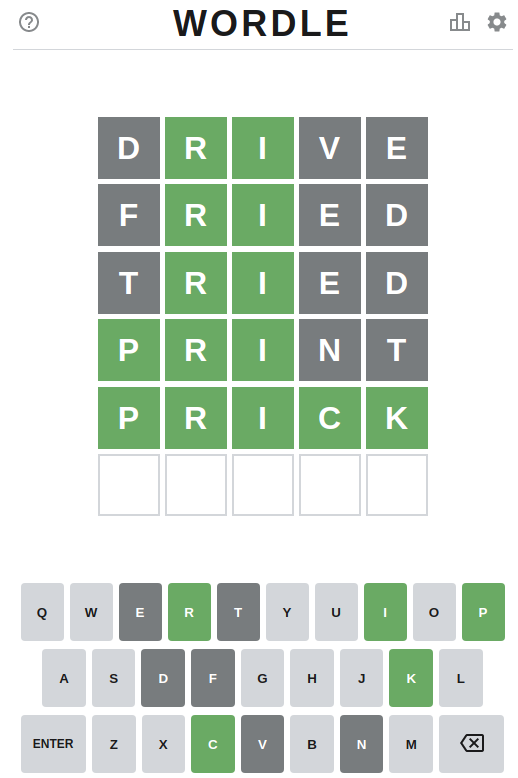

# README
This repo is a solver/AI for Wordle.

[Wordle](https://www.powerlanguage.co.uk/wordle/) is a word guessing game where players guess a five-letter word and are given hints about their guess.  It's similar to the old [Mastermind game](https://en.wikipedia.org/wiki/Mastermind_(board_game)): hints can tell you that you've got the right letter in the wrong place, or the right letter in the right place.

The failed guesses are marked in grey, and the correct-but-in-the-wrong-place guesses are marked in orange (though I didn't do this in the screenshot, making it a poor illustration of the concept).

## Strategies
Wordle only accepts input of valid words, so a lot of this code is just a simple filtering routine for five-letter words.

At each turn, given a dictionary of five-letter words, we:

 - Find words that match the green letter pattern;
 - Remove words that contain grey letters in the remaining positions;
 - Remove words that _don't_ contain orange letters in the remaining positions.

This often gets us down to just a few words, using the [stanford GraphBase](https://www-cs-faculty.stanford.edu/~knuth/sgb.html) wordlist.

Next, we need to ensure we keep the number of guesses below 6, so we use some heuristics to pick the best word.  Heuristics implemented:

 - Pick at random;
 - Pick the word with the most likely letter frequencies by position (e.g. 1st letter most likely to be `r`, etc);
 - Pick the word with the most likely bigram frequencies --- this strategy makes use of the information given by the green letters quite well

On the wish list:

 - Pick words that give maximum search space coverage/information gain.  In practice this might not give much of a boost
 - Take into account the past Wordle words, on the assumption that the people running the site probably curate the list to avoid repetition.

## Dependencies
This project requires python 3.8 (typehints...) and not much else.

## Using
This project is at a pretty early stage and isn't well structured yet.  Run `wordle.py` to run a series of games against the built-in wordle.

## Future work
Much of this will probably remain undone.

 - Thorough assessment of performance, to evaluate heuristics;
 - Tournament between heuristics (since they don't affect one another this would be similar to the above, but it would reveal some specific strengths/weaknesses);
 - A UI to enter data from the real-world-wordle, or integration with wordle itself to play against the real site;
 - Tests.  Yes this is last.  Yes that's probably bad.

## License
Beerware.  Send me an email if you like it.
